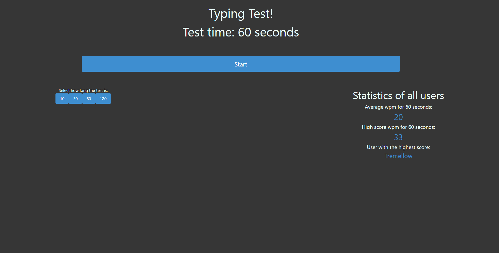
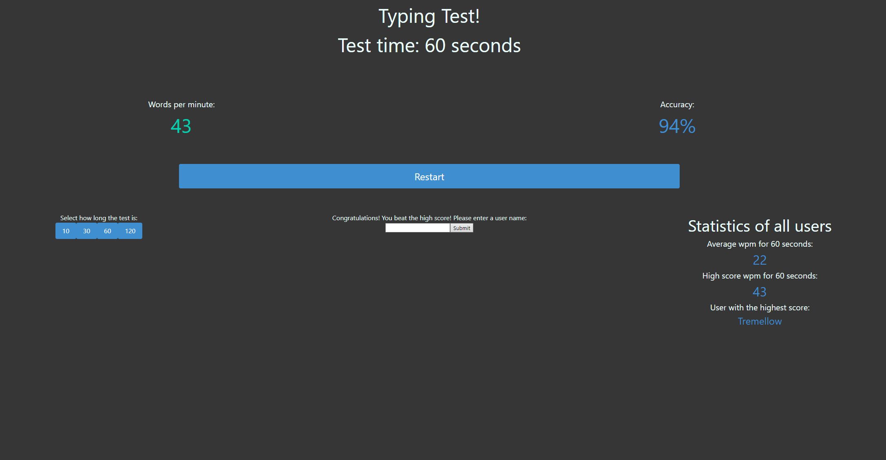

This website is designed to help the user determine how fast they type as well as practicing typing.
The user can take tests lasting 10, 30, 60, and 120 seconds.
The average of all tests taken, the highest score, and the username of the one with the highest score
The API used is https://random-word-api.vercel.app/api to get the words for the test and everything else is my own personal API in the backend.

